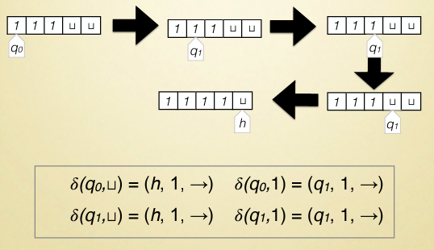

### Alan Turing
- Che cos'è una computazione?
- Cosa siginifica per un problema essere calcolabile?
Osserviamo come gli umani risolvono problemi e cerchiamo di formalizzare il processo:
- seguiamo un insieme di regole
- leggiamo e scriviamo simboli
- l'azione dipende dal simbolo letto
Adesso astraiamo il processo.

### Macchina di Turing
**Definizione informale:** 
Una macchina di Turing ha un nastro infinito sul lato destro diviso in celle.
Ogni cella contiene un simbolo o è vuota.
La macchina ha una testina che si muove sul nastro ed è in uno stato.
La configurazione è un passo computazionale.
La configurazione iniziale ha la testina nella prima cella a sinistra nello stato iniziale q0. Il nastro è vuoto tranne che per una sequenza di simboli in input $a = a_1, a_2, a_3, ..., a_m$ che occupano le prime m celle.
La testina legge il contenuto della cella e sulla base del contenuto:
- si ferma
- cambia stato: scrivere un nuovo simbolo nella cella corrente(o lasciarla vuota) e spostare la testina a sinistra o a destra

**Definizione formale:**
Una macchina di Turing è una tupla $\langle \Sigma, Q, q_0, H, \delta \rangle$ dove:
- $\Sigma$ è un alfabeto finito di simboli(include $\sqcup$ simbolo vuoto)
- Q è un insieme finito di stati
- $q_0 \in Q$ è lo stato iniziale
- $H \subseteq Q$ è l'insieme degli stati di accettanti(o finali)
- $\delta: Q \backslash H \times \Sigma \rightarrow Q \times \Sigma \times \{\rightarrow, \leftarrow \}$ è la funzione di transizione (stato corrente $\times$ simbolo letto $\rightarrow$ prossimo stato $\times$ simbolo da scrivere $\times$ direzione della testina)

La funzione di transizione esprime il programma della macchina di Turing, è una funzione totale.
Possiamo scrivere la funzione di transizione come:
$\{\langle q_x(stato attuale della macchina), a_y(simbolo letto), q_z(prossimo stato), b_w(simbolo da scrivere), S(direzione della testina) \rangle\}$
*Esempio:* 
 $\{\langle q_i, a, q_j, \sqcup, \rightarrow \rangle\}$ : la macchina è nello stato $q_i$, legge il simbolo $a$, scrive il simbolo $\sqcup$ nella cella corrente, si sposta a destra e passa nello stato $q_j$.
*Esempio:* 

*Esempio:*
Addizione unaria: $\sqcup 1 1 1 + 1 1 1 \sqcup$

- finchè leggo 1 vado a destra e scrivo 1 
- quando leggo * scrivo 1 e vado a destra
- proseguo leggendo 1 e scrivendo 1
- quando leggo $\sqcup$ vado a sinistra scrivendo $\sqcup$ 
- quando ritrovo 1 vado a sinistra e scrivo $\sqcup$. 

### Espressività delle Macchine di Turing
#### Problemi di decisione
Input: dati del tipo corretto
Output: si o no
Una macchina di Turing calcola funzioni del tipo $\mathbb{N}^k \rightarrow \mathbb{N}$.
Per rappresentare un problema di decisione basta codificare il problema come la funzione caratteristica di un linguaggio formale.

*Linguaggio formale:* dato un insieme finito $\Sigma$ di simboli, un linguaggio formale su $\Sigma$ è un sottoinsieme di $\Sigma^*$.
*Esempio:* $\Sigma = \{1\}$, $L = \{\epsilon, 1, 11, 111, ...\}$
La funzione caratteristica di un linguaggio formale è la funzione $\chi_L(x): \Sigma^* \rightarrow \{0, 1\}$ definita come:
$\chi_L(x) = \begin{cases} 1 & \text{se } x \in L \\ 0 & \text{se } x \notin L \end{cases}$

**Da un problema di decisione a un linguaggio formale**
Il linguaggio formale associato a un problema di decisione è: $L = \{x \in \Sigma^* | x = code(\alpha)\}$ dove code codifica il dato di input $\alpha$.
Code deve rispettare le seguenti proprietà:
- se $\alpha \neq \beta$ allora $code(\alpha) \neq code(\beta)$
- dovremmo poter verificare se $x \in \Sigma^*$ è code($\alpha$) per qualche $\alpha$.
- dovremmo poter recuperare $\alpha$ da code($\alpha$).

**Linguaggi decidibili**
Come ragionare su un problema di decisione usando una macchina di Turing.
- la codifica del problema di decisione come L su un alfabeto $\Sigma'$.
- vogliamo una macchina di Turing $\mathcal{M}$ con le seguenti proprietà:
    - l'alfabeto di input/output $\Sigma_{l}$ è $\Sigma'$
    - l'insieme degli stati finali $H$ è $\{Y, N\}$
- $\mathcal{M}$ *accetta* un input $x \in \Sigma_{l}^*$ se la computazione termina nello stato $Y$. *Rigetta* l'input se la computazione termina nello stato $N$.
- $\mathcal{M}$ *decide* L se:
    - $x \in L$, allora $\mathcal{M}$ accetta $x$
    - $x \notin L$, allora $\mathcal{M}$ rigetta $x$

Un linguaggio(o problema) è decidibile se esiste una macchina di Turing che decide il linguaggio.

**Linguaggi riconoscibili**
Ulteriore modo per ragionare su un problema di decisione usando una macchina di Turing.
- la codifica del problema di decisione come L su un alfabeto $\Sigma'$.
- alfabeto di input/output $\Sigma'$
- $\mathcal{M}$ *riconosce* L se:
    - $x \in L$, allora $\mathcal{M}$ si ferma(raggiunge uno stato finale)
    - $x \notin L$, allora $\mathcal{M}$ non si ferma(enrtra in un loop)
    
Un linguaggio(o problema) è riconoscibile se esiste una macchina di Turing che riconosce il linguaggio.