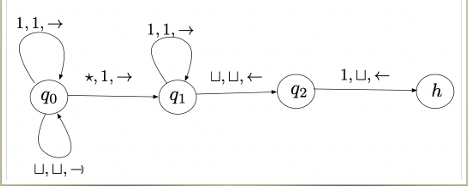

### Alan Turing
- Che cos'è una computazione?
- Cosa siginifica per un problema essere calcolabile?
Osserviamo come gli umani risolvono problemi e cerchiamo di formalizzare il processo:
- seguiamo un insieme di regole
- leggiamo e scriviamo simboli
- l'azione dipende dal simbolo letto
Adesso astraiamo il processo.

### Macchina di Turing
**Definizione informale:** 
Una macchina di Turing ha un nastro infinito sul lato destro diviso in celle.
Ogni cella contiene un simbolo o è vuota.
La macchina ha una testina che si muove sul nastro ed è in uno stato.
La configurazione è un passo computazionale.
La configurazione iniziale ha la testina nella prima cella a sinistra nello stato iniziale q0. Il nastro è vuoto tranne che per una sequenza di simboli in input $a = a_1, a_2, a_3, ..., a_m$ che occupano le prime m celle.
La testina legge il contenuto della cella e sulla base del contenuto:
- si ferma
- cambia stato: scrivere un nuovo simbolo nella cella corrente(o lasciarla vuota) e spostare la testina a sinistra o a destra

**Definizione formale:**
Una macchina di Turing è una tupla $\langle \Sigma, Q, q_0, H, \delta \rangle$ dove:
- $\Sigma$ è un alfabeto finito di simboli(include $\sqcup$ simbolo vuoto)
- Q è un insieme finito di stati
- $q_0 \in Q$ è lo stato iniziale
- $H \subseteq Q$ è l'insieme degli stati di accettanti(o finali)
- $\delta: Q \backslash H \times \Sigma \rightarrow Q \times \Sigma \times \{\rightarrow, \leftarrow \}$ è la funzione di transizione (stato corrente $\times$ simbolo letto $\rightarrow$ prossimo stato $\times$ simbolo da scrivere $\times$ direzione della testina)

La funzione di transizione esprime il programma della macchina di Turing, è una funzione totale.
Possiamo scrivere la funzione di transizione come:
$\{\langle q_x(stato attuale della macchina), a_y(simbolo letto), q_z(prossimo stato), b_w(simbolo da scrivere), S(direzione della testina) \rangle\}$
*Esempio:* 
 $\{\langle q_i, a, q_j, \sqcup, \rightarrow \rangle\}$ : la macchina è nello stato $q_i$, legge il simbolo $a$, scrive il simbolo $\sqcup$ nella cella corrente, si sposta a destra e passa nello stato $q_j$.
*Esempio:* 

*Esempio:*
Addizione unaria: $\sqcup 1 1 1 + 1 1 1 \sqcup$

- finchè leggo 1 vado a destra e scrivo 1 
- quando leggo * scrivo 1 e vado a destra
- proseguo leggendo 1 e scrivendo 1
- quando leggo $\sqcup$ vado a sinistra scrivendo $\sqcup$ 
- quando ritrovo 1 vado a sinistra e scrivo $\sqcup$. 

### Espressività delle Macchine di Turing
#### Problemi di decisione