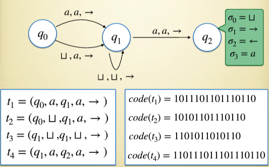
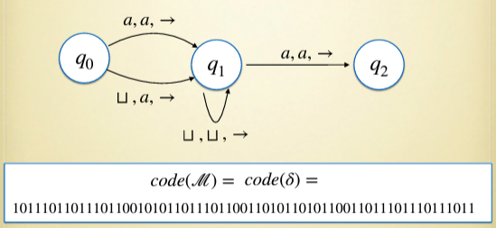

### UTM(Universal Turing Machine)
#### Programma Universale
Un programma universale è un programma che può ricevere in input altri programmi e dati e restituire in output il risultato dell'esecuzione del programma in input sui dati in input.

Possiamo pensare all'architettura dei calcolatori come una gerarchia di macchine universali, le une eseguite dalle altre. 

#### Macchina di Turing Universale(UTM)
Una macchina di Turing universale è una macchina di Turing che può prendere in input una descrizione di un'altra macchina di Turing e un input per quella macchina e restituire in output il risultato dell'esecuzione della macchina in input sui dati in input.

**Definizione:**
- La UTM prende una stringa $y$ in input.
- Verifica che $y$ sia della forma $(code(\mathcal{M}), code(x))$, dove $code(-)$ è una codifica, $\mathcal{M}$ è una TM e $x$ è una stringa dell'alfabeto $\Sigma_l$ di $\mathcal{M}$.
- La UTM simula la TM $\mathcal{M}$ con input $x$.

Si ferma se $\mathcal{M}$ si ferma con input $x$, con output $code(z)$, altrimenti non si ferma.

*Simulare significa che su input $y=(code(\mathcal{M}), code(x))$, la UTM dà lo stesso output di $\mathcal{M}$ su input $x$.*

**Teorema:**
Esiste una macchina di Turing universale.

**Dimostrazione:**
Ci costruiamo una macchina di Turing universale.

**Codificare una TM:**
Ci concentriamo sulla definizione di uan codifica $code(-)$. 
Traduciamo una TM $\mathcal{M} = \langle \Sigma, Q, q_0, H, \delta \rangle$ in una stringa binaria su alfabeto $\{0, 1\}$.
Convenzioni:
- Gli stati in $Q$ sono ordinati $q_0, q_1, q_2, ...$, con $q_0$ lo stato iniziale.
- Ordiniamo i simboli che possono apparire nelle transizioni $\delta$ in $\delta_0 = \sqcup, \delta_1 = \rightarrow, \delta_2 = \leftarrow$, e gli altri simboli in $\Sigma$ come $\delta_3, \delta_4, ...$.
- Codifichiamo una tupla $t = \langle q_i, \delta_n, q_j, \delta_m, \delta_o \rangle$ di $\delta$ come $code(t) = code(q_i)0code(\delta_n)0code(q_j)0code(\delta_m)0code(\delta_o)0$.
- Codifichiamo tutta la funzione di transizione $\delta = \{t_1, t_2, t_3, ...\}$ come $code(\delta) = code(t_1)0code(t_2)0code(t_3)0...$.
- Possiamo dedurre gli stati finali di $H$, sono quelle transizioni che non compaiono in $\delta$(non occorrono mai in prima posizione in una tupla).

*Esempio:*

*Osservazioni:*
- due macchine di Turing diverse hanno codifiche diverse(codifica iniettiva).
- due o più macchine diverse possono computare la stessa funzione, ma codificate in maniera diversa(esprimono un diverso algoritmo per la stessa funzione).
- data una stringa su $\{0, 1\}$, è possibile determinare se il codice è di una TM(e se sì, quale). E' un problema decidibile.

**Costruzione della UTM:**
*Promemoria:*
Eseguire la UTM su input $y = (code(\mathcal{M}), code(x))$ dovrebbe restituire lo stesso output di $\mathcal{M}$ su input $x$.
- UTM non ferma su input $y$ se e solo se $\mathcal{M}$ non ferma su input $x$.
- UTM ferma su input $y$ con output $code(z)$ se e solo se $\mathcal{M}$ ferma su input $x$ con output $z$.

*Costruzione:*
La UTM è una macchina di Turing con 3 nastri:
- il primo nastro manterrà il nastro di $\mathcal{M}$ in forma codificata.
- il secondo nastro manterrà $code(\mathcal{M})$(tutte le transizioni di $\mathcal{M}$ in forma codificata).
- il terzo nastro manterrà lo stato corrente di $\mathcal{M}$ in forma codificata.

Simulazione della UTM:
- passo di preparazione: verifica $y = (code(\mathcal{M}), code(x))$ per qualche TM $\mathcal{M}$ e input $x$. Se no, ciclo infinito. Se sì, allora il nastro 1 contiene $(code(\mathcal{M}), code(x))$(la codifica della macchina e l'input).
- sposta $code(\mathcal{M})$ sul nastro 2. Adesso il nastro 1 mostra il contenuto del nastro di $\mathcal{M}$ su input $x$ alla configurazione iniziale, in forma codificata.
- scrivi $code(q_0)$ sul nastro 3. 
- posizione testina 1(del primo nastro) sul primo simbolo di $code(x)$, testina 2(del secondo nastro) sul primo simbolo di $code(\mathcal{M})$, testina 3(del terzo nastro) sul primo simbolo di $code(q_0)$.

Un passo di simulazione:
1. Cerca in $code(\mathcal{M})$ una tupla $t = \langle q_i, \delta_n, q_j, \delta_m, \delta_o \rangle$ dove $q_i$ coincida con lo stato corrente sul nastro 3 e $\delta_n$ coincida con il simbolo letto sul nastro 1.
2. Aggiorna il nastro 1 scrivendo $\delta_m$ nella posizione corrente e sposta la testina in base a $\delta_o$.
3. Aggiorna il nastro 3 con lo stato $q_j$. Se è finale, fermati.

