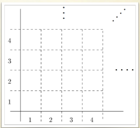
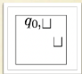
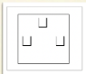
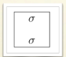
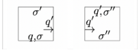
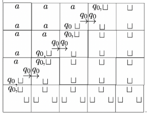

### Tiling problem
Ci concentriamo sulla non calcolabilità del problema di *Tiling*.

**Problema:**
Dato un insieme di piastrelle e di regole per metterle insieme, esiste una disposizione del piano che rispetti tali regole?

#### Sistema di Tiling
Un sistema di tiling è costituito da:
- un insieme di piastrelle quadrate $\mathcal{T}$
- una piastrella di origine $t_0 \in \mathcal{T}$ 
- un insieme di regole di adiacenza tra piastrelle

**Definizione:**
Un tiling è una disposizione di piastrelle in $\mathcal{T}$ con le sueguenti proprietà:
- $t_0$ si trova nell'angolo in basso a sinistra
- ogni piastrella ha una piastrella sopra e una a destra, senza spazi
- tutte le regole di adiacenza sono rispettate

*Esempio di regole di adiacenza:*
- una piastrella nera non può avere a destra una grigio chiara

#### Problema di Tiling
Dato un sistema di tiling, il problema è decidere se esiste un tiling.

**Definizione:**
Un sistema di tiling è una tupla $\langle \mathcal{T}, t_0, H, V \rangle$ tale che:
- $\mathcal{T}$ è un insieme finito di piastrelle
- $t_0 \in \mathcal{T}$ è la piastrella di origine
- $H \subseteq \mathcal{T} \times \mathcal{T}$ è un insieme di regole di adiacenza orizzontali e $V \subseteq \mathcal{T} \times \mathcal{T}$ è un insieme di regole di adiacenza verticali

**Definizione:**
Il Tiling, assumendo un quadrato positivo diviso in celle con delle coordinate, e una funzione $f: \mathbb{N} \times \mathbb{N} \rightarrow \mathcal{T}$ tale che:
1.  $f(1, 1) = t_0$
2.  $(f(n, m), f(n+1, m)) \in H$ per ogni $n, m \in \mathbb{N}$
3.  $(f(n, m), f(n, m+1)) \in V$ per ogni $n, m \in \mathbb{N}$

**Dimostrazione:**
Riduciamo il Tiling problem a $ETH^-$, implicando che esso non sia riconoscibile da nessuna TM.

Due passi:
1.  Mostriamo che ogni TM $\mathcal{M}$ può essere traformata in un sistema di tiling $\mathcal{T_{\mathcal{M}}}$

2.  Questa trasformazione è fatta in modo tale per cui $code(\mathcal{M}) \in ETH \Leftrightarrow \text { non eiste un tiling per } \mathcal{T_{\mathcal{M}}}$. Tale corrisponde riduce $ETH$ al complemento del tiling problem, così che $ETH^-$ si riduce al tiling problem.

*Traduzione di regole di adiacenza e piastrelle:* $\newline$
Per convenzione segnamo i margini delle piastrelle con delle lettere, solo i margini con le stesse lettere possono essere accoppiate

*Da una TM $\mathcal{M}$ a un sistema di tiling $\mathcal{T_{\mathcal{M}}}$:* $\newline$
- L'idea è che le file successive del Tiling rappresentano i passi della computazione della TM. Piastrelle speciali sono usate per rappresentare lo stato corrente della TM e posizione della testina.
- Definiamo la piastrella d'origine $t_0$.
$\newline$

- Definiamo la piastrella che rappresenta il vuoto.
$\newline$

- Per ogni simbolo $\sigma \in \Sigma$ includiamo una piastrella che lo rappresenta.
$\newline$

- Per ogni $q \in Q\backslash \{ h \}$ e $\sigma, \sigma' \in \Sigma$ per cui $\delta(q, \sigma) = (q', \sigma', \rightarrow)$, includiamo una piastrella, e per ogni $\sigma'' \in \Sigma$.
$\newline$

*Esempio di Tiling:* $\newline$
Questo Tiling rappresenta la computazione della TM $\mathcal{M}$ su un input $\epsilon$.
$\newline$

*Il Tiling problem è irriconoscibile:* $\newline$
- Supponiamo che esista una TM $\mathcal{M}$ che si fermi su input $\epsilon$.
- Il tiling inizierà con una prima fila di piastrelle che rappresentano lo stato iniziale della TM.
- Ogni passo successivo $i$ della computazione è rappresentato dalla fila $i$ del tiling.
- Se la TM si ferma, non esiste un Tiling che rappresenta la computazione della TM, perchè non esiste una fila $n + 1$ che rappresenta il prossimo passo della computazione.
- Se la TM non si ferma, il Tiling non terminerà mai.
- Quindi, il tiling problem è irriconoscibile.

## OGNI PROBLEMA DI EQUIVALENZA CON UNA TM È INDECIDIBILE