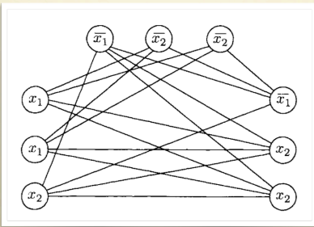
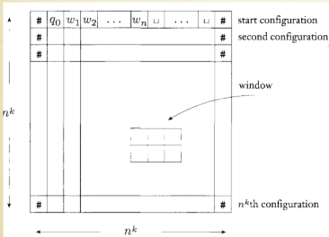

### Teorema di Cook-Levin
**Definizione:**
Se $SAT \in P$ allora $P = NP$

Definiremo $SAT$ come $NP-COMPLETO$, se fosse in $P$ allora sarebbero in $P$ tutti i problemi di $NP$.
Dimostreremo che qualsiasi problema in $NP$ riducibile in tempo polinomiale a $SAT$.

#### Poly Reduction
**Definizione:**
Siano $L$ e $L'$ linguaggi sull'alfabeto $\Sigma$. Diciamo che $L'$ è poly (mapping-)riducibile a $L$, scritto $L' \leq_p L$, se esiste una TM che computa *in tempo polinomiale* una funziona(totale) $f : \Sigma^* \rightarrow \Sigma^*$ tale che $x \in L' \Leftrightarrow f(x) \in L$.

In altre parole: $L' \leq_p L$ se $L' \leq L$ e la riduzione è computabile in tempo polinomiale.

**Teorema:**
Se $L' \leq_p L$ e $L \in P$, allora $L' \in P$.

**Dimostrazione:**
DA FARE

**Teorema:**
Per $L$ non triviale in $P$, $L^- \leq_p L $.

**Dimostrazione:**
DA FARE

**Domanda:**
Per $L$ non triviale in $NP$, $L^- \leq_p L $?

**Risposta:**
DA FARE

#### Formule booleane
**Definizione:**
Un *formula booleana* è composta da variabili $x, y , ..., \bar{x}, \bar{y}, ... \in \{0, 1\}$ e le loro combinazioni tramite $\land$ e $\lor$

**Soddisfacibilità:**
Una formula è *soddisfacibile* se esiste un assegnamento di valore alle sue variabile che le dia valore 1

*Esempio:*
La formula $(\bar{x} \lor y) \land (x \lor y)$ è soddisfacibile per $x = 1, y = 1, z = 0$

**Clausola:**
Una formula è una *clausola* se è una disgiunzione di variabili.

**CNF:**
Una formula è una *forma normale congiunta* se è una congiunzione di *clausole*

*Esempio:*
$(x \lor y) \land (\bar{z} \lor z) \land (\bar{x} \lor y \lor z \lor \bar{z})$

**3CNF:**
Una formula è $3CNF$ se è in *cnf* e ogni *clausola* contiene esattamente 3 letterali.

#### $3SAT \leq_p CLIQUE$
**Definizione:**
$SAT = \{\langle F \rangle\ | F \text{ è una formula booleana soddisfacibile }\}$
$3SAT = \{\langle F \rangle\ | F \text{ è una formula booleana 3cnf soddisfacibile }\}$

La riduzione è interessante perchè collega un problema sulle formule logiche a uno sui grafi.

**Teorema:**
$\langle F \rangle\ \in 3SAT \Leftrightarrow f(\langle F \rangle) \in CLIQUE$

**Dimostrazione:**
*Idea:* 
Tradurremo formule in grafi, dove $f(\langle F \rangle)$ sarà costruito in modo da mimare il comportamento di variabili e clausole: un clique $f(\langle F \rangle)$ corrisponderà ad un assegnamento che soddisfa $\langle F \rangle$.

Sia $F$ una formula con $k$ clausole e $n$ variabili : $F = (a_1 \lor b_1 \lor c_1) \land (a_2 \lor b_2 \lor c_2) \land (a_3 \lor b_3 \lor c_3)$
- Definiamo $f(\langle F \rangle) = \langle G, k \rangle$ un grafo come segue:
    - nodi: $G$ ha $3k$ nodi(uno per ogni letterale, essendo $3SAT$), suddivisi in $k$ gruppi $t_1, t_2, ..., t_k$ chiamate *triple*. Ogni triple corrisponde ad una clausola di $F$, perciò etichettiamo i nodi con $a_i, b_i, c_i$ corrispondenti a $t_i$.
    - archi: gli archi collegano le coppie $(n_1, n_2)$ eccetto se $n_1$ e $n_2$ sono nella stessa triple o sono letterali complementari(ovvero $n_1 = \bar{n_2}$)

La costruzione del grafo $G$ richiede tempo polinomiale rispetto alla dimensione di $\langle F \rangle$.

*Esempio:*
Per la formula $F = (x_1 \lor x_1 \lor x_2) \land (\bar{x_1} \lor \bar{x_2} \lor \bar{x_2}) \land (\bar{x_1} \lor x_2 \lor x_2)$

(Per esempio un *clique* in questa immagine è formato dai nodi $x_2, \bar{x_1}, \bar{x_1}$, ed ha senso perchè se metti quelli veri, allora è soddisfacibile la formula $F$)

($\langle F \rangle \in 3SAT \rightarrow f(\langle F \rangle) \in CLIQUE$)
- Se $F$ è soddisfacibile, almeno un letterale per clausola è vero, selezioniamo il nodo corrispondente nel grafo $G$ avendo così un nodo per tripla(ovvero un nodo per clausola). Questa selezione forma un clique di grandezza $k$, poichè ci sono $k$ triple e ogni nodo selezionato è collegato agli latri della selezione per costruzione.

($\langle F \rangle \in 3SAT \leftarrow f(\langle F \rangle) \in CLIQUE$)

- Se $f(\langle F \rangle) = \langle G, k \rangle$ e $G$ ha un clique $S$ di grandezza $k$, assegnamo vero ai letterali corrispondenti ai nodi in $S$(assegnamento $A$ di valori di verità alle variabili di $F$). Poichè $S$ è un clique, non ci sono archi tra un nodo e un suo complemento e ogni nodo in $S$ è in una tripla diversa. Perciò $A$ assegna vero a essattamente un letterale per clausola, quindi rende vera $F$.

### Teorema di Cook-Levin
#### NP-Completezza
**Definizione:**
Un linguaggio $L$ è *NP-completo* se è in $NP$ e ogni altro linguaggio $L'$ in $NP$ è poly riducibile a $L$(ovvero $L' \leq_p L$).

*Esempio:*
$TMSAT = \{\langle x, w, s, t \rangle\ |\ x = code(M) \text{ per qualche TM } M \text{ e } M \text{ accetta } \langle w, c \rangle \text{ per qualche } c \text{ con } |c| \leq s \text{ in al più } t \text{ passi}\}$

$TMSAT$ è $NP-completo$.

#### Teorema di Cook-Levin
**Teorema:**
$SAT$ è $NP-completo$

**Corollario:**
Se $SAT \in P$ allora $P = NP$

**Dimostrazione:**
Dimostrare che $SAT \in NP$ è facile, poichè data una formula $F$ possiamo costruire una TM non deterministica che verifica se un assegnamento di valori di verità rende vera $F$ in tempo polinomiale.

Rimane da dimostrare che ogni linguaggio in $NP$ è poly riducibile a $SAT$.

Supponi che M sia la TM non deterministica che decide $L$. Dobbiamo tradurre una stringa $w$ in una formula $F_w$ tale che assegnamenti di valore $A$ a $F_w$ corrispondono a computazioni di $M$ su $w$. Quindi $A$ rende vera $F_w$ se e solo se $M$ accetta $w$.

*Dimostrazione:*
- Supponiamo che $M = \langle \Sigma, Q, q_0, \delta, \{Y, N\} \rangle$ decida $L$ in tempo $n^k$, per qualche $k$ costante.
- Definiamo un *tableau* per $M$ come una tabella $n^k \times n^k$, dove ogni riga corrisponde ad una configurazione(stato corrente della macchina, simboli sul nastro e la posizione della testina) di $M$ in un passo della computazione su $w$ e ogni colonna rappresenta una posizione del nastro in quel passo. Le transizioni tra le righe seguono la funzione $\delta$.

Stabilire se $M$ accetta $w$ è equivalente a stabilire se esiste un tableau accettante per $M$ su $w$.

- Definiamo $F_w = F_{cell} \land F_{start} \land F_{move} \land F_{accept}$
- L'insieme di variabili di $F_w$ è $\{x_{i, j, s}\ |\ (i, j) \in [n^k] \times [n^k], s \in Q \cup \Sigma \cup \{\#\}\}$, vogliamo assegnare 1(vero) a $x_{i, j, s}$ se la cella $(i, j)$ contiene il simbolo $s$.
    - $F_{cell}$: dobbiamo assegnare 1 a esattamente un $x_{i, j, s}$ per ogni $(i, j)$ e $s$(ovvero bisogna rendere vera una variabile per ogni cella del tableau)
    - $F_{start}$: la prima riga corrisponde a una configurazione iniziale di $M$ su $w$
    - $F_{move}$: i simboli nelle celle devono descrivere una computazione legale di $M$ su $w$ che rispetti la funzione di transizione $\delta$
    - $F_{accept}$: almeno una delle configurazioni(righe) nel tableau è accettante(Y)

(Per com'è costruita la formula se esiste un assegnamento che soddisfa $F_w$ allora esiste un tablueau accettante, quindi $M$ accetta $w$. Questo collega $SAT$ alla computazione di una macchina di Turing non-deterministica dimotrando così la $NP$-completezza)

La computazione di una TM è locale, quindi è sufficiente esprimere una condizione che riguardi le *finestre* (di dimensione $2 \times 3$) del tableau.
$$F_{cell} = \bigwedge_{1 \leq i, j \leq n^k} [\bigvee_{s \in C} x_{i, j, s}\land \bigwedge_{s, t \in C, s \neq t} (\neg x_{i, j, s} \lor \neg x_{i, j, t})]$$
$$F_{start} = x_{1, 1, \#} \land x_{1, 2, q_0} \land x_{1, 3, w_1} \land ... \land x_{1, n^{k-1}, \sqcup} \land x_{1, n^k, \#}$$
$$F_{move} = \bigwedge_{1 \leq i \leq n^k, 1 \leq j \leq n^k} (\bigvee_{a_1, ..., a_6 \text{ è una finestra ammessa}} x_{i, j - 1, a_1} \land x_{i, j, a_2} \land x_{i, j + 1, a_3} \land x_{i + 1, j - 1, a_4} \land x_{i + 1, j, a_5} \land x_{i + 1, j + 1, a_6})$$
$$F_{accept} = \bigvee_{1 \leq i, j \leq n^k} x_{i, j, Y}$$

$F_w$ è soddisfacibile $\Leftrightarrow$ esiste un tableau accettante $\Leftrightarrow$ $M$ accetta $w$

Abbiamo dimostrato che:
- $F_w$ è soddisfacibile $\Leftrightarrow$ esiste un tableau accettante

Dobbiamo dimostrare che:
- La costruzione di $F_w$ richiede tempo polinomiale rispetto a $w$

- Il tableau ha dimensione $n^k \times n^k$, quindi contiene $n^{2k}$ celle, dove ogni cella contiene uno tra $m = |Q| + |\Sigma| + 1$ simboli. Quindi il numero di variabili in $F_w$ è $n^{2k} \cdot m = O(n^{2k})$.
- $F_{cell}$ contiene una sottoformula(si intende la formula sopra per calcolarlo) di lunghezza costante per ogni cella, quindi richiede $O(n^{2k})$.
- $F_{start}$ contiene una sottoformula di lunghezza costante per ogni cella, quindi richiede $O(n^{k})$.
- Sia $F_{move}$ che $F_{accept}$ contengono una sottoformula di lunghezza costante per ogni cella, quindi richiedono $O(n^{2k})$.
- Quindi la costruzione di $F_w$ richiede tempo polinomiale rispetto a $w$.

#### Altri problemi $NP-completi$
**Teorema:**
$3SAT$ è $NP-completo$

**Corollario:**
$CLIQUE$ è $NP-completo$

*Altri esempi:*
- problema del commesso viaggiatore
- colorare un grafo con k colori
- vincere a battaglia navale
- fare mining di bitcoin in tempo polinomiale
- serializzabilità della cronologia di un database